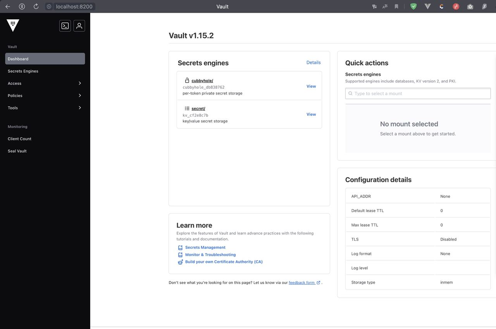

University: [ITMO University](https://itmo.ru/ru/)  
Faculty: [FICT](https://fict.itmo.ru)  
Course: [Introduction to distributed technologies](https://github.com/itmo-ict-faculty/introduction-to-distributed-technologies)  
Year: 2023/2024  
Group: K4112c  
Author: Tasmaev Igor Aleksandrovich  
Lab: Lab1  
Date of create: 09.11.2023  
Date of finished: 10.11.2023

### Цель работы

Ознакомиться с инструментами Minikube и Docker, развернуть свой первый "под".

### Ход работы

1. Содзан манифест создания пода:

```yaml
apiVersion: v1
kind: Pod
metadata:
  name: "vault"
  namespace: default
  labels:
    app: "vault"
spec:
  containers:
    - name: vault
      image: "hashicorp/vault:1.15.2"
      ports:
        - containerPort: 8200
          name: http
```

2. Поднят под, создан сервис, проброшены порты
```bash
itasm@i109817109 bin % minikube kubectl -- run vault --image=hashicorp/vault
pod/vault created
itasm@i109817109 bin % minikube kubectl -- expose pod vault --type=NodePort --port=8200
service/vault exposed
itasm@i109817109 bin % minikube kubectl -- port-forward service/vault 8200:8200

Forwarding from 127.0.0.1:8200 -> 8200
Forwarding from [::1]:8200 -> 8200
Handling connection for 8200
```

3. Получен токен для входа в Vault:

```bash
itasm@i109817109 bin % minikube kubectl -- logs vault
Couldn't start vault with IPC_LOCK. Disabling IPC_LOCK, please use --cap-add IPC_LOCK
==> Vault server configuration:

Administrative Namespace:
             Api Address: http://0.0.0.0:8200
                     Cgo: disabled
         Cluster Address: https://0.0.0.0:8201
   Environment Variables: GODEBUG, HOME, HOSTNAME, KUBERNETES_PORT, KUBERNETES_PORT_443_TCP, KUBERNETES_PORT_443_TCP_ADDR, KUBERNETES_PORT_443_TCP_PORT, KUBERNETES_PORT_443_TCP_PROTO, KUBERNETES_SERVICE_HOST, KUBERNETES_SERVICE_PORT, KUBERNETES_SERVICE_PORT_HTTPS, NAME, PATH, PWD, SHLVL, VAULT_PORT, VAULT_PORT_8200_TCP, VAULT_PORT_8200_TCP_ADDR, VAULT_PORT_8200_TCP_PORT, VAULT_PORT_8200_TCP_PROTO, VAULT_SERVICE_HOST, VAULT_SERVICE_PORT, VERSION
              Go Version: go1.21.3
              Listener 1: tcp (addr: "0.0.0.0:8200", cluster address: "0.0.0.0:8201", max_request_duration: "1m30s", max_request_size: "33554432", tls: "disabled")
               Log Level:
                   Mlock: supported: true, enabled: false
           Recovery Mode: false
                 Storage: inmem
                 Version: Vault v1.15.2, built 2023-11-06T11:33:28Z
             Version Sha: cf1b5cafa047bc8e4a3f93444fcb4011593b92cb

==> Vault server started! Log data will stream in below:

2023-11-09T11:04:49.085Z [INFO]  core: vault is unsealed
2023-11-09T11:04:49.089Z [INFO]  core: successful mount: namespace="" path=secret/ type=kv version=""
WARNING! dev mode is enabled! In this mode, Vault runs entirely in-memory
and starts unsealed with a single unseal key. The root token is already
authenticated to the CLI, so you can immediately begin using Vault.

You may need to set the following environment variables:

    $ export VAULT_ADDR='http://0.0.0.0:8200'

The unseal key and root token are displayed below in case you want to
seal/unseal the Vault or re-authenticate.

Unseal Key: 1p9cmM80RRzQnKiHBy9T3szyZCoOthvExJsKeuslWYo=
Root Token: hvs.WHHUeorUC6EETp06BXjnJC5R

Development mode should NOT be used in production installations!
```

4. Произведен вход в Vault:




### Вывод

В результате выаолнения лаборатнорной работы был создан тестовый kubernetes кластер с помощью minikube, в котором был развернуты один под и сервис, после чего к Pod был получен удаленный доступ с помощью проброса портов. В ходе работы были изучены принципы формирования соединений при создании пода, сервиса и использовании проброса портов.