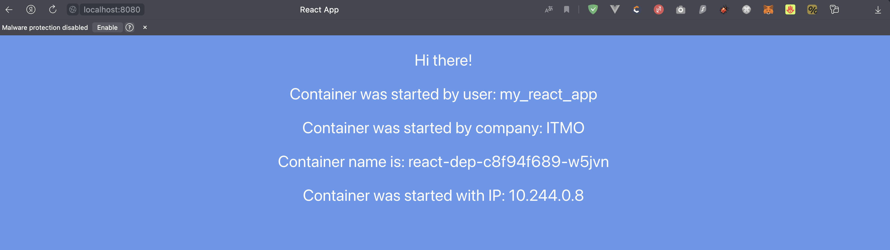

University: [ITMO University](https://itmo.ru/ru/)  
Faculty: [FICT](https://fict.itmo.ru)  
Course: [Introduction to distributed technologies](https://github.com/itmo-ict-faculty/introduction-to-distributed-technologies)  
Year: 2023/2024  
Group: K4112c  
Author: Tasmaev Igor Aleksandrovich  
Lab: Lab2  
Date of create: 22.11.2023  
Date of finished: 

### Цель работы

Ознакомиться с типами "контроллеров" развертывания контейнеров, ознакомится с сетевыми сервисами и развернуть свое веб приложение.

### Ход работы

1. Создан манифест deployment с двумя репликами предложенного контейнера:

```yaml
apiVersion: apps/v1
kind: Deployment
metadata:
  name: react-dep
spec:
  replicas: 2
  selector:
    matchExpressions:
      - key: app
        operator: In
        values:
          - front
  template:
    metadata:
      labels:
        creation_method: deployment
        app: front
    spec:
      containers:
        - image: ifilyaninitmo/itdt-contained-frontend:master
          name: react
          ports:
            - name: http
              containerPort: 3000
          env:
            - name: REACT_APP_USERNAME
              value: my_react_app
            - name: REACT_APP_COMPANY_NAME
              value: ITMO
```

2. В кластере развернут Deployment:
   
```bash
itasm@i109817109 lab2 % minikube kubectl -- apply -f manifest.yaml       
deployment.apps/react-dep configured
itasm@i109817109 lab2 % minikube kubectl -- apply -f service.yaml
service/front-serv configured
itasm@i109817109 lab2 % minikube kubectl -- apply -f service.yaml
service/front-serv configured
itasm@i109817109 lab2 % minikube kubectl -- port-forward service/front-serv 8080:3000
Forwarding from 127.0.0.1:8080 -> 3000
Forwarding from [::1]:8080 -> 3000
Handling connection for 8080
Handling connection for 8080
```

3. В кластере развернут сервис: 

```bash
itasm@i109817109 lab2 % minikube kubectl -- get service -o wide
NAME         TYPE        CLUSTER-IP      EXTERNAL-IP   PORT(S)          AGE   SELECTOR
front-serv   NodePort    10.100.159.89   <none>        3000:32123/TCP   17m   app=front
```

4. Произведена проверка работоспособности:




### Вывод

В результате выаолнения лаборатнорной работы в ранее созданном кластере Minikube было развернуто два пода с помощью deployment, после чего к ним был предоставлен доступ через сервис. Также в ходе работы были изучены принципы работы Depolyment и ReplicaSet, а также принципы распределения трафика между контейнерами.