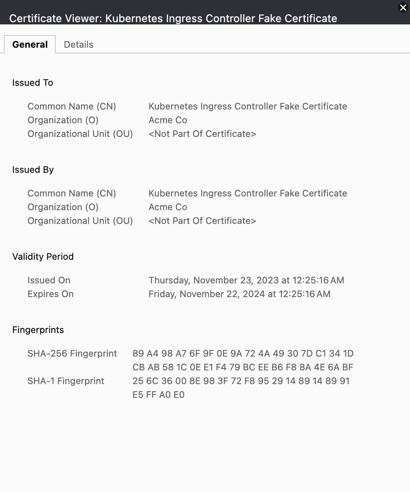

University: [ITMO University](https://itmo.ru/ru/)  
Faculty: [FICT](https://fict.itmo.ru)  
Course: [Introduction to distributed technologies](https://github.com/itmo-ict-faculty/introduction-to-distributed-technologies)  
Year: 2023/2024  
Group: K4112c  
Author: Tasmaev Igor Aleksandrovich  
Lab: Lab3  
Date of create: 22.11.2023  
Date of finished: 23.11.2023

### Цель работы

Познакомиться с сертификатами и "секретами" в Minikube, правилами безопасного хранения данных в Minikube.

### Ход работы

1. Создан шаблон configMap с необходимыми переменными:

```yaml
apiVersion: v1
kind: ConfigMap
metadata:
  name: conf-map
data:
  username: my_react_app
  company_name: ITMO
```

2. Создан шаблон replicaSet, использующий значения из созданной configMap:
   
```yaml
apiVersion: apps/v1
kind: ReplicaSet
metadata:
  name: rep-set
spec:
  replicas: 2
  selector:
    matchExpressions:
      - key: app
        operator: In
        values:
          - front
  template:
    metadata:
      labels:
        app: front
    spec:
      containers:
        - image: ifilyaninitmo/itdt-contained-frontend:master
          name: front
          env:
            - name: REACT_APP_USERNAME
              valueFrom:
                configMapKeyRef:
                  name: conf-map
                  key: username
            - name: REACT_APP_COMPANY_NAME
              valueFrom:
                configMapKeyRef:
                  name: conf-map
                  key: company_name
          ports:
            - name: http
              containerPort: 3000
```

3. ReplicaSet и ConfigMap развернуты в кластере Minikube:

```bash
itasm@i109817109 lab3 % minikube kubectl -- apply -f config.yaml                     
configmap/conf-map created
itasm@i109817109 lab3 % minikube kubectl -- apply -f replica.yaml
replicaset.apps/rep-set created
itasm@i109817109 lab3 % minikube kubectl -- get pod -o wide
NAME                        READY   STATUS    RESTARTS      AGE   IP            NODE       NOMINATED NODE   READINESS GATES
rep-set-4sfl8               1/1     Running   0             22s   10.244.0.11   minikube   <none>           <none>
rep-set-8hsfm               1/1     Running   0             22s   10.244.0.10   minikube   <none>           <none>
```

4. Включен ingress аддон и сгенерирован TLS сертификат:


```bash
itasm@i109817109 lab3 % minikube addons enable ingress
💡  ingress is an addon maintained by Kubernetes. For any concerns contact minikube on GitHub.
You can view the list of minikube maintainers at: https://github.com/kubernetes/minikube/blob/master/OWNERS
💡  After the addon is enabled, please run "minikube tunnel" and your ingress resources would be available at "127.0.0.1"
    ▪ Using image registry.k8s.io/ingress-nginx/kube-webhook-certgen:v20231011-8b53cabe0
    ▪ Using image registry.k8s.io/ingress-nginx/kube-webhook-certgen:v20231011-8b53cabe0
    ▪ Using image registry.k8s.io/ingress-nginx/controller:v1.9.4
🔎  Verifying ingress addon...
🌟  The 'ingress' addon is enabled
```

5. Создан секрет minikube

```bash
itasm@i109817109 lab3 % minikube kubectl -- create secret tls ingress-tls --cert mk.crt --key mk.key      
secret/ingress-tls created
```

6. Создан шаблон ingress с использованием tls:

```yaml
apiVersion: networking.k8s.io/v1
kind: Ingress
metadata:
  name: ingress
spec:
  tls:
    - hosts:
        - example.com
      secretName: ingress-tls
  rules:
    - host: example.com
      http:
        paths:
          - pathType: Prefix
            path: /front
            backend:
              service:
                name: front
                port:
                  number: 80
```

7. Ingress развернут в кластере Minikube:

```bash
itasm@i109817109 lab3 % minikube kubectl -- apply -f ingress.yaml
ingress.networking.k8s.io/ingress created
itasm@i109817109 lab3 % minikube kubectl -- get ingress -o wide
NAME      CLASS   HOSTS         ADDRESS        PORTS     AGE
ingress   nginx   example.com   192.168.49.2   80, 443   118s
itasm@i109817109 lab3 % minikube tunnel                          
✅  Tunnel successfully started

📌  NOTE: Please do not close this terminal as this process must stay alive for the tunnel to be accessible ...

❗  The service/ingress ingress requires privileged ports to be exposed: [80 443]
🔑  sudo permission will be asked for it.
🏃  Starting tunnel for service ingress.
```

8. Осуществленна проверка наличия сертификата веб приложения:
  



### Вывод

В результате выаолнения лаборатнорной работы в ранее созданном кластере Minikube был поднят ингресс с использованием фейкового tls сертификата. Рассмотрены методы хранения конфигураций при помощи configMap, а также секретов minikube.