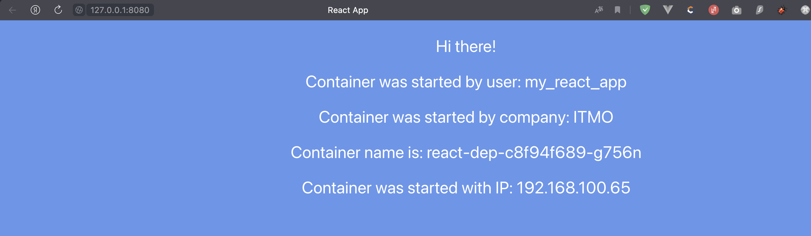

University: [ITMO University](https://itmo.ru/ru/)  
Faculty: [FICT](https://fict.itmo.ru)  
Course: [Introduction to distributed technologies](https://github.com/itmo-ict-faculty/introduction-to-distributed-technologies)  
Year: 2023/2024  
Group: K4112c  
Author: Tasmaev Igor Aleksandrovich  
Lab: Lab4  
Date of create: 06.12.2023  
Date of finished: 

### Цель работы

Познакомиться с CNI Calico и функцией IPAM Plugin, изучить особенности работы CNI и CoreDNS.

### Ход работы

1. Запущен minikube с плагином calico и режимом работы Multi-Node Clusters:

```bash
itasm@i109817109 lab4 % kubectl get pods -A
NAMESPACE     NAME                                       READY   STATUS    RESTARTS      AGE
kube-system   calico-kube-controllers-558d465845-lkbq8   1/1     Running   1 (80s ago)   114s
kube-system   calico-node-9rqvk                          1/1     Running   0             107s
kube-system   calico-node-r79rk                          1/1     Running   0             114s
itasm@i109817109 lab4 % kubectl get nodes
NAME                 STATUS   ROLES           AGE     VERSION
multinode-demo       Ready    control-plane   2m23s   v1.28.3
multinode-demo-m02   Ready    <none>          2m      v1.28.3
```

2. Добавлены метки узлам по признаку стойки:
   
```bash
itasm@i109817109 lab4 % kubectl label nodes multinode-demo rack=100
node/multinode-demo labeled
itasm@i109817109 lab4 % kubectl label nodes multinode-demo-m02 rack=101
node/multinode-demo-m02 labeled
itasm@i109817109 lab4 % kubectl get nodes --show-labels                
NAME                 STATUS   ROLES           AGE   VERSION   LABELS
multinode-demo       Ready    control-plane   16m   v1.28.3   beta.kubernetes.io/arch=amd64,beta.kubernetes.io/os=linux,kubernetes.io/arch=amd64,kubernetes.io/hostname=multinode-demo,kubernetes.io/os=linux,minikube.k8s.io/commit=8220a6eb95f0a4d75f7f2d7b14cef975f050512d,minikube.k8s.io/name=multinode-demo,minikube.k8s.io/primary=true,minikube.k8s.io/updated_at=2023_12_07T16_45_10_0700,minikube.k8s.io/version=v1.32.0,node-role.kubernetes.io/control-plane=,node.kubernetes.io/exclude-from-external-load-balancers=,rack=100
multinode-demo-m02   Ready    <none>          15m   v1.28.3   beta.kubernetes.io/arch=amd64,beta.kubernetes.io/os=linux,kubernetes.io/arch=amd64,kubernetes.io/hostname=multinode-demo-m02,kubernetes.io/os=linux,rack=101
```

3. Создан манифест Calico ipPool:

```yaml
apiVersion: projectcalico.org/v3
kind: IPPool
metadata:
  name: rack-100-ippool
spec:
  cidr: 192.168.100.0/24
  ipipMode: Always
  natOutgoing: true
  nodeSelector: rack == "100"

---

apiVersion: projectcalico.org/v3
kind: IPPool
metadata:
  name: rack-101-ippool
spec:
  cidr: 192.168.101.0/24
  ipipMode: Always
  natOutgoing: true
  nodeSelector: rack == "101"
```

4. IPPool'ы развернуты в кластере Minikube:


```bash
itasm@i109817109 lab4 % kubectl delete ippools default-ipv4-ippool
ippool.crd.projectcalico.org "default-ipv4-ippool" deleted
itasm@i109817109 lab4 % calicoctl create -f ipPool.yaml --allow-version-mismatch
itasm@i109817109 lab4 % kubectl get ippools -o wide                             
NAME              AGE
rack-100-ippool   37s
rack-101-ippool   7s
```

1. Создан манифест deployment:

```yaml
apiVersion: apps/v1
kind: Deployment
metadata:
  name: react-dep
spec:
  replicas: 2
  selector:
    matchExpressions:
      - key: app
        operator: In
        values:
          - front
  template:
    metadata:
      labels:
        creation_method: deployment
        app: front
    spec:
      containers:
        - image: ifilyaninitmo/itdt-contained-frontend:master
          name: react
          ports:
            - name: http
              containerPort: 3000
          env:
            - name: REACT_APP_USERNAME
              value: my_react_app
            - name: REACT_APP_COMPANY_NAME
              value: ITMO
```

1. Создан манифест service:

```yaml
apiVersion: v1
kind: Service
metadata:
  name: front-serv
spec:
  type: NodePort
  ports:
    - name: http
      port: 3000
      targetPort: http
      nodePort: 32123
  selector:
    app: front
```

7. Deployment и service развернуты в кластере Minikube, а также запущен форвардинг портов:

```bash
kubectl create -f manifest.yaml                  
deployment.apps/react-dep created
itasm@i109817109 lab4 % kubectl create -f service.yaml 
service/front-serv created
itasm@i109817109 lab4 % kubectl get rs -o wide
NAME                  DESIRED   CURRENT   READY   AGE   CONTAINERS   IMAGES                                         SELECTOR
react-dep-c8f94f689   2         2         2       66s   react        ifilyaninitmo/itdt-contained-frontend:master   app in (front),pod-template-hash=c8f94f689
itasm@i109817109 lab4 % kubectl get pods -o wide
NAME                        READY   STATUS    RESTARTS   AGE   IP                NODE                 NOMINATED NODE   READINESS GATES
react-dep-c8f94f689-g756n   1/1     Running   0          72s   192.168.100.65    multinode-demo       <none>           <none>
react-dep-c8f94f689-kx8rt   1/1     Running   0          72s   192.168.101.194   multinode-demo-m02   <none>           <none>
itasm@i109817109 lab4 % kubectl get service -o wide
NAME         TYPE        CLUSTER-IP      EXTERNAL-IP   PORT(S)          AGE   SELECTOR
front-serv   NodePort    10.110.63.129   <none>        3000:32123/TCP   62s   app=front
kubernetes   ClusterIP   10.96.0.1       <none>        443/TCP          36m   <none>
itasm@i109817109 lab4 % kubectl port-forward service/front-serv 8080:3000 
Forwarding from 127.0.0.1:8080 -> 3000
Forwarding from [::1]:8080 -> 3000
Handling connection for 8080
```

8. Получен доступ к подам через ip контейнера (Minikube узла) и проверены значения Container name и Container IP:
  


9. Осуществлена проверка достпуности подов с помощью пинга FQDN имени соседнего пода:

```bash
itasm@i109817109 distributed % kubectl exec react-dep-c8f94f689-g756n nslookup  192.168.100.65
kubectl exec [POD] [COMMAND] is DEPRECATED and will be removed in a future version. Use kubectl exec [POD] -- [COMMAND] instead.
Server:         10.96.0.10
Address:        10.96.0.10:53

65.100.168.192.in-addr.arpa     name = 192-168-100-65.front-serv.default.svc.cluster.local

itasm@i109817109 distributed % kubectl exec react-dep-c8f94f689-g756n ping 192-168-100-65.front-serv.default.svc.cluster.local
kubectl exec [POD] [COMMAND] is DEPRECATED and will be removed in a future version. Use kubectl exec [POD] -- [COMMAND] instead.
PING 192-168-100-65.front-serv.default.svc.cluster.local (192.168.100.65): 56 data bytes
64 bytes from 192.168.100.65: seq=0 ttl=64 time=0.021 ms
64 bytes from 192.168.100.65: seq=1 ttl=64 time=0.035 ms
64 bytes from 192.168.100.65: seq=2 ttl=64 time=0.045 ms
64 bytes from 192.168.100.65: seq=3 ttl=64 time=0.034 ms
```

### Вывод

В результате выаолнения лаборатнорной работы был создан тестовый двухузловой kubernetes кластер с помощью minikube и CNI Calico. В созданном кастере были созданы ippools для каждого узла, после чего была осуществленна проверка привязки ip адресов, путем создания двух подов с помощью deployment.